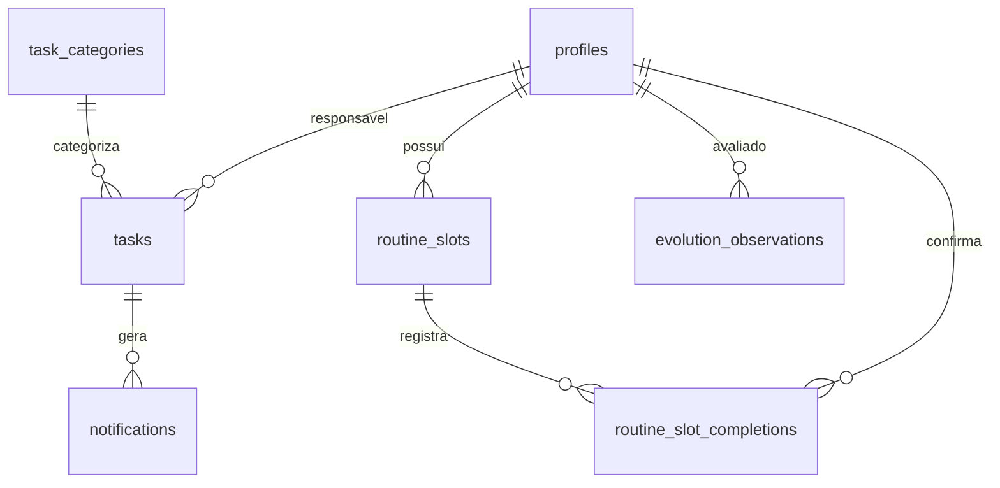

<div align="center">

# Agenda

Sistema web de gestão de tarefas e rotina para equipes. Calendário compartilhado, rotina semanal fixa, relatórios, estatísticas e notificações em tempo real via Supabase Realtime.

## Funcionalidades

**Dashboard** — visão do dia com filtros por usuário e status, tarefas atrasadas, taxa de conclusão e lista de tarefas de hoje.

**Agenda** — calendário mensal compartilhado com tarefas coloridas por categoria. Criar, editar e excluir tarefas diretamente no dia.

**Rotina** — grade semanal de blocos fixos de horário por usuário, com marcação de cumprimento, drag-and-drop entre dias/horários e espelhamento de um dia para outros.

**Relatórios** — relatório de atividades com filtros por período, status, prioridade, categoria e responsável.

**Estatística** — KPIs do período (total, concluídas, pendentes, taxa de conclusão) e tendência de conclusão.

**Evolução** — espaço de observações de melhoria/desempenho/atenção, com níveis de urgência e responsável.

**Usuários** — perfis cadastrados.

**Configurações** — tema claro/escuro, notificações do navegador e dados da conta.

**Notificações** — lembretes no horário das tarefas do dia e alerta quando uma tarefa atribuída a você é concluída por outra pessoa (Web Notifications + sons).

## Stack

**Frontend:** React 19, TypeScript, Vite 8, Tailwind CSS v4, React Router v7
**Estado:** Zustand
**Backend:** Supabase (Auth, Postgres, Realtime, Storage)
**UI:** Radix UI, Framer Motion, Recharts, Sonner, Lucide
**Qualidade:** Vitest, oxlint, GitHub Actions CI

## Pré-requisitos

Node.js >= 22.12.0
Projeto Supabase (ou CLI `supabase` para rodar as migrations localmente)

## Como rodar

**1. Instale as dependências**

```bash
npm install
```

**2. Configure as variáveis de ambiente**

```bash
cp .env.example .env
```

| Variável | Descrição |
|---|---|
| `VITE_SUPABASE_URL` | URL do projeto (ex.: `https://xxxx.supabase.co`) |
| `VITE_SUPABASE_ANON_KEY` | Chave anônima (publishable key) do projeto |

**3. Aplique o schema do banco** (migrations em `supabase/migrations/`)

```bash
supabase db push
```

**4. Inicie o servidor de desenvolvimento**

```bash
npm run dev
```

## Scripts

| Script | Descrição |
|---|---|
| `npm run dev` | Servidor de desenvolvimento (Vite) |
| `npm run build` | Typecheck + build de produção (`tsc -b && vite build`) |
| `npm run lint` | Lint (oxlint) |
| `npm test` | Testes (Vitest) |
| `npm run test:watch` | Testes em modo watch |
| `npm run preview` | Preview do build |

<div align="left">

## Estrutura do projeto

```
src/
├── components/
│   ├── agenda/      # Componentes de domínio (calendário, tarefas, rotina, categorias)
│   ├── layout/      # Sidebar e layout do dashboard
│   └── ui/          # Kit de UI (button, card, dialog, input, select...)
├── hooks/           # useAuth, notificações de tarefas
├── lib/             # Cliente Supabase, utilitários, cálculos de performance
├── pages/           # Login, Dashboard, Agenda, Rotina, Usuários, Relatórios,
│                     # Estatística, Evolução, Configurações
├── stores/          # Zustand (auth, agenda)
└── types/           # Tipos espelhando as tabelas do banco

supabase/
└── migrations/      # Schema, RLS, triggers e índices
```

</div>

## Banco de dados

Tabelas principais: `tasks`, `task_categories`, `profiles`, `evolution_observations`, `notifications`, `routine_slots`, `routine_slot_completions`.

RLS habilitado em todas. Trigger `handle_new_user` sincroniza perfis; trigger `notify_task_completed` notifica conclusão de tarefa.



## Deploy

**Vercel** — o `vercel.json` já configura o rewrite de SPA. Configure `VITE_SUPABASE_URL` e `VITE_SUPABASE_ANON_KEY` como variáveis de ambiente no dashboard.

**CI** — `.github/workflows/ci.yml` roda lint, testes e build em push/PR para `main`.

## Licença

Uso interno.

</div>
